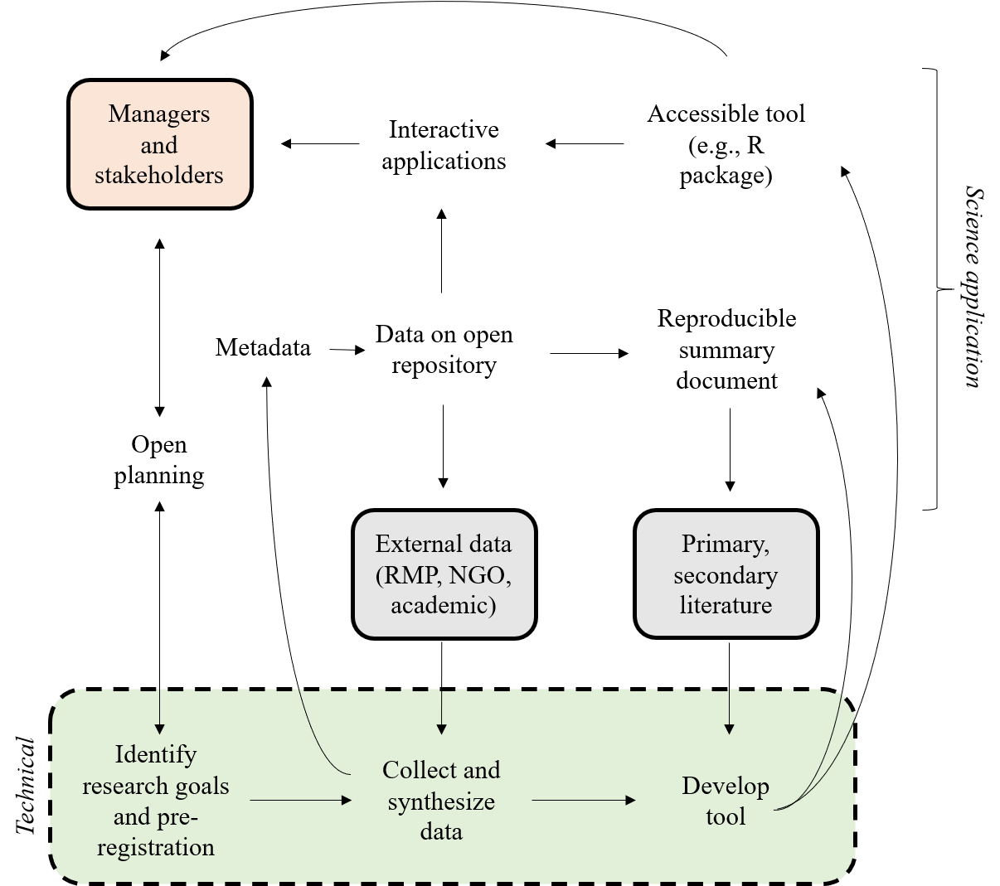

```{r setup, echo = F, warning = F, message = F, results = 'hide'}
# figure path, chunk options
knitr::opts_chunk$set(fig.path = 'figs/', warning = F, message = F, echo = F, cache = T, dev.args = list(family = 'serif'), dpi = 300, warning = F, cache.path = 'manu_draft_cache/',
  fig.process = function(x) {
  x2 = sub('-\\d+([.][a-z]+)$', '\\1', x)
  if (file.rename(x, x2)) x2 else x
  })

# libraries
library(Jabbrev)
library(tidyverse)
library(gridExtra)
library(raster)
library(sp)
library(sf)
library(leaflet)
library(RColorBrewer)

# functions (incl. color palettes)
source('R/funcs.R')

data(calipsa)
data(scrs)
data(sgrlu)
data(shed)
data(spat)

# extract bib entries from online
bib_scrp('manu_draft.Rmd', 'refs.bib')
```

```{r echo = F, cache = F}
raw <- system('git log -1', intern = TRUE)
raw <- raw[grep('^Date', raw)]
raw <- paste('Version', raw)
```
`r raw`

```{r echo = F, cache = F, eval = F}
spelling::spell_check_files('manu_draft.Rmd')
```

# Abstract 

Open science principles that seek to democratize science can effectively bridge the gap between researchers and environmental managers.  However, widespread adoption has yet to gain traction for the development and application of bioassessment products.  At the core of this philosophy is the concept that research should be reproducible and transparent, in addition to having long-term value through effective data preservation and sharing.  In this paper, we review core open science concepts that have recently been adopted in the ecological sciences and emphasize how adoption can benefit the field of bioassessment for both prescriptive condition assessments and proactive applications that inform environmental management.  An example from the state of California demonstrates effective adoption of open science principles through data stewardship, reproducible research, and engagement of stakeholders with multimedia applications.  We also discuss technical, sociocultural, and institutional challenges for adopting open science, including practical approaches for overcoming these hurdles in bioassessment applications.

# Introduction

Bioassessment is an essential element of aquatic monitoring programs and helps to establish a foundation of decisions for managing the ecological integrity of environmental resources.  Legal mandates to assess biological condition have set a precedent for developing bioassessment products in the United States (Clean Water Act, CWA), Canada (Canada Waters Act), and Europe (Water Framework Directive).  Decades of research to meet these mandates have supported the development of assessment indices for multiple assemblages with regional applications in streams, rivers, lakes, and marine environments [@Karr86;@Kerans94;@Fore02;@Beck09;@Borja09].  Substantial technical advances have been made in predicting biological responses to environmental change [@Hawkins00;@Hawkins00b], how these responses can be distinguished from natural environmental variation [@Stoddard06], and determining the impacts of these changes [@Davies06]. The use of these products to suport environmental management distinguishes bioassessment from basic ecological research. Although bioassessment can and has been used to inform basic research, its intended use is to inform the protection and restoration of ecological integrity.  As such, environmental managers require additional tools that transform bioassessment products into actionable information.  

Integrating bioassessment products into management or regulatory frameworks is a larger implementation challenge that continues to inhibit progress, despite the technological advances [@Kuehne17]. Characterizing how an index could be used in practice to inform decisions and prioritize management actions is often opaque relative to why an index may have been originally developed. Numerous assessment products have been developed for specific regional applications [@Birk12] and concerns about redundancy, comparability, duplicated effort, and lack of coordinated monitoring have recently been discussed within the research community [@Cao11;@Poikane14;@Kelly16;@Nichols16]. Moreover, existing indices may not be easily replicated beyond initial research applications [@Hering10;@Nichols16] or may be incorrectly applied based on differences between goals for developing an index and the needs of management programs [@Dale01;@Stein09]. The abundance of available products can be a point of frustration for managers given a lack of guidance for choosing among alternatives, particularly as to how different assessment products relate to specific management, monitoring, or policy objectives [@Dale01;@Stein09].  

To address these challenges, a new mode of operation is needed where method development is open and transparent, developed products are discoverable and reproducible, and most importantly, implementation in the management community is intuitive and purposeful.  Open science principles that democratize all aspects of the scientific method can help meet these needs and there is a unique opportunity in bioassessment to leverage oppenness to support public resources. Others have advocated more broadly for inclusion of open science principles in the ecological sciences [@Hampton15;@Hampton16;@Lowndes17] and a growing wave of momentum has influenced how scientists conceptualize research in other disciplines [e.g., archaeology, @Marwick16; behavioral ecology, @Ihle17; hydrology, @Slater19; vegetation sciences, @Collins16].  Adopting an open science paradigm in bioassessment is particularly relevant compared to other fields given the explicit need to develop products that are accessible to the management community. Legal and ethical precedents in bioassessment may also necessitate open data sharing given that environmental monitoring programs are often established to protect and maintain publicly-owned natural resources.

This review demonstrates tools and approaches for open science to empower the research and management community to embrace a new mode of thinking for bioassessment applications. These approaches are expected to benefit the bioassessment research community by augmenting existing workflows for developing assessment products and improving their ability to address environmental issues by bridging the gap between the scientific, management, and regulatory communities. As such, this paper is written primarily for the research team that develops bioassessment products, but we also write for the funders and users (i.e., regulators and managers) of these products to emphasize the value of investing in open science for the protection of public resources. Herein, open science "tools" describe best practices and specific applications that use an open philosophy to support applied science.  

# Principles of open science

Conventional modes of creating scientific products and more contemporary approaches that align with open science principles share the same goals.  Both are motivated by guiding principles of the scientific method that make the process of discovery transparent and repeatable. Where the conventional and open science approaches diverge is the extent to which technological advances are leveraged as instrumental tools that facilitate the entire research process.  Distinction between the two approaches can be conceptualized as the "research paper as the only and final product" for the conventional approach, whereas the open science approach is inherently linked to advances in communication and analysis that have been facilitated by the Internet and computer sciences (Table \@ref(tab:osprinc)).  As a result, the open science approach can enhance all aspects of the scientific process from initial conception of a research idea to the delivery and longevity of a research product (Figure \@ref(fig:basicflow)).  The process is iterative where products are improved by the individual and/or others, facilitated by open science tools that enhance access and reproducibility of data. 

The paradigm of the research paper as a final scientific product can inhibit the uptake of research methods and findings by environmental managers.  The research paper is conventionally viewed as a communication tool for scientists to report and share results among peers.  Researchers access periodicals to stay informed of scientific advances and use the information to replicate methods for follow-up analysis.  Although the primary literature continues to provide these fundamental services, this workflow is problematic when scientific products are needed to serve interests outside of the research community.  For example, the paper as an endpoint for environmental managers fails to deliver products that are easily accessible from the practitioners perspective, both in application and interpretation.  A research paper is less likely to effect environmental change because it does not provide a mechanism to transfer actionable information to those that require scientific guidance for decision-making, such as sharing analysis code or results that describe output from assessment products. Numerous studies have documented implementation failures as a result of siloing among research communities where the flow of information does not extend beyond institutional walls [e.g., @Mitchell05;@Liu08].  Information loss over time is another well-known flaw associated with the paradigm of research paper as final product [@Michener97].

## Open data as a component of the open science process

Open data is a fundamental component of the broader open science process in Figure \@ref(fig:basicflow). Under this mode of thinking, the research team becomes stewards of its data. Stewardship allows the data to be treated as a living product with a traceable and replicable provenance (i.e., origin), rather than proprietary and serving only the internal needs of an immediate research goal. Metadata that describe the structure and history of a dataset ensure the data have an identity. Metadata also encourage adoption of core data structures that allow integration across different sources, which is critical for collaboration across institutional boundaries [@Horsburgh16;@Hsu17].  Other open science practices, such as integration of data with dynamic reporting tools or submitting data to a federated repository (i.e., a decentralized database system for coordination and sharing), can facilitate communication for researchers and those for which the research was developed [@BondLamberty16]. 

Open data can benefit research by contributing to an increase in novel products created through collaboration.  Collaborative publications have increased in the environmental sciences as research teams leverage open data to create synthesis products that allow novel insights from comparisons across multiple datasets. Quantitative meta-analyses and systematic reviews are increasingly used to extract information from the primary literature [@Lortie14].  In addition, open data products can increase efficiency of the individual researcher and a collective research team by encouraging collaborators to adopt an open science workflow.  Many tools developed within the software and computer science community to facilitate open process and the creation of open data are now easily accessible to environmental scientists.  Version control software (e.g, Git, GitHub), open source programming languages (e.g, R, Python), and integrated development environments (IDEs, e.g., RStudio, Spyder) can all be leveraged to dynamically create and share open data products that build institutional memory.  These tools promote deliberate and shared workflows among researchers that can lead to better science in less time [@Lowndes17] and have proven useful in recent applications in the hydrologic sciences [@Idaszak17;@Slater19].

Open access to data can also benefit management and regulatory communities.  Openness can improve the value of data from monitoring programs by establishing workflows for data discovery and synthesis, often through the adoption of a common metadata structure and integration of data within federated data networks (e.g., [DataONE](https://www.dataone.org/), [iRODS](https://irods.org/)).  Open data maintained by management or regulatory communities benefits the research community, which in turn benefits the data maintainers that require scientific products to inform decisions.  Open data can also improve public trust in scientific findings by exposing the underlying information used to develop a research product [@Grand12].  Similar concepts are used in "blockchain" technologies that allow public financial transactions in an open, distributed format, as for trading in cryptocurrencies [@Pilkington16]. Increased trust could facilitate eventual adoption of proposed rules or regulations that are based on research products created from open data.

# Applying open science principles to bioassessment

Here we provide a detailed description of open science processes that the bioassessment community could leverage to create reproducible, transparent, and discoverable research products for environmental managers.  The below examples require understanding the distinction between the general open science process in Figure \@ref(fig:basicflow), open data as an individual component of the open science process, and the technology-based tools that can be used to achieve these ends.  Both the tools and open data are critical components that facilitate the broader process to achieve the principles outlined in Table \@ref(tab:osprinc). However, open science tools can also be used by individual researchers in an entirely closed workflow with no collaboration or discoverability by others.  Similarly, open data can be created through an entirely closed process even though it may appear as an open science product.  "Openness" of process, tools, and data exists on a continuum, and incremental improvements can transform an individual's and research group's practice over time.  We encourage awareness that an open process adopts the open science tools that are appropriate for a research question, the creation of open data can be a fundamental component of the process, and acceptance by the research team and collaborators of the concepts described in Table \@ref(tab:osprinc) is critical to achieving openness.  

The overall process is shown in Figure \@ref(fig:closedopen) as an expansion of general concepts in Figure \@ref(fig:basicflow), with a specific science application phase for implementation.   This iterative flow of information is facilitated by 1) openly sharing planning documents, 2) using established metadata standards to document synthesized data products, 3) hosting data products on open repositories, 4) creating reproducible summary documents that integrate the data and research products, and 5) incorporating the developed product into interactive applications that deliver the results to the managers and stakeholders.  The technical phase of defining research goals, collecting and synthesizing data, and developing the bioassessment product are primary tasks of the research team.  However, the process is distinguished by the flow of information to and from the research phase that can benefit the specific project and the science of bioassessment as a whole.

### Developing bioassessment goals

In an open science process, the goals identified by the research team for developing a bioassessment product should occur through direct, two-way interaction with the management or regulatory institution that requires the product.  This two-way exchange of information can be accomplished through direct communication and sharing of planning documents to ensure all decisions are transparent, i.e., open planning.  In person meetings are ideal, but planning documents are dynamic and will require remote sharing and revision as ideas progress.  Online tools such as [Google documents](https://www.google.com/docs/about/), [Slack](https://slack.com/) discussion channels, and open lab notebooks can be instrumental for collaboration. More informal approaches, such as blogging and sharing ideas on social media, can expose new concepts to the broader community for guidance [@Woelfle11;@Darling13].  Overall, the research team should use these tools to identify stakeholder needs while also considering the balance between the research goals and limitations of the data to meet these goals.   This will ensure that the needs of the management and stakeholder communities will be consistent with the services provided by the research product.  

### Curating bioassessment data

After project goals are established, the research team identifies requirements and sources of data that need to be synthesized to meet the research needs. Bioassessment data, or more generally, biological data obtained from field sampling have a unique set of challenges that require added vigilance in data stewardship [@Cao11].  Taxonomic resolution requires a tradeoff between specificity with added cost [@Lenat01;@Chessman07] and names change regularly requiring updates to standard taxonomic effort ([STE](http://www.safit.org/Docs/STE_1_March_2011_7MB.pdf)) tables that are critical for many biological indices.  Unidentified or ambiguous taxa must also be explicitly treated in analysis workflows [@Cuffney07], e.g., are they treated as missing values or are they substituted with coarser taxonomic designations?  Environmental data that describe physical or chemical conditions are also critical to support development of an assessment index, as well as understanding potential stressors or background condition that could influence biological condition. 

As an example, a multimetric index may require taxonomic data collected at multiple sites by different institutions, whereas the output data may include summary scores, individual metrics, and any additional supporting information to assess the quality of the output. These data products can easily be documented using a standardized metadata language (e.g., Ecological Metadata Language Standard, or [EML](https://knb.ecoinformatics.org/external//emlparser/docs/index.html)) which describes the who, what, and why to ensure the data have an identity.  Adoption of a metadata standard also ensures that a machine-readable file is produced to allow integration into a data repository.  This will allow a synthesized data product to be discoverable beyond the specific research application and will provide metadata to help others understand the context of the data.  Finally, the dataset can be assigned a unique digital object identifier (DOI, e.g., through [Zenodo](https://zenodo.org/)) that provides a permanent address and is also citable to allow researchers to track usage of a bioassessment data product. 

In an open paradigm, the data itself is a product to achieve the research goals and also becomes available to the research and management community as a fully documented source of information that has value beyond the specific project.  The openness of the synthesized data product is one of the primary means of facilitating the application of a bioassessment product.  The synthesized data product can be used by the research team to create interactive applications for stakeholders to share and explore the data and is also fully integrated into summary reports using software for generating dynamic documents [e.g, using `knitr`, @Xie15; RMarkdown, @Allaire18; Jupyter notebooks, @Kluyver16]. The data product also becomes available on an open data repository that is discoverable by other researchers and can contribute to alternative scientific advances beyond the immediate goals (e.g., Hydroshare for the hydrologic sciences, @Idaszak17). 

### Using R for bioassessment application

The R statistical programming language [@RDCT18] is one of the most commonly used analysis platforms in the environmental sciences [@Lai19;@Slater19] and many existing R packages have value for the bioassessment community (Table \@ref(tab:rpkgtab)).  For managing the day to day tasks of working with multiple datasets, the `tidyverse` suite of packages provides the necessary tools to import, wrangle, explore, and plot almost any data type [@Wickham17b].  These packages are developed around the concept of "tidy" data that provide a common and natural framework for working with data [@Wickham14c]. The `tidyverse` also includes the powerful `ggplot2` package that is based on a syntactical grammar of graphics for plotting [@Wilkinson05;@Wickham09].  This package provides a set of independent plotting instructions that can be built piecewise and is a departure from other graphics packages that represent a collection of special cases that limit the freedom of the analyst.  In bioassessment, `ggplot2` can be used both in an exploratory role during the development phase and also to create publication quality graphics.  More importantly, this package provides the building blocks to create effective data visualizations that convey important components of a bioassessment product to managers and stakeholders.   

Bioassessment data are inherently spatial and recent package development has greatly improved the ability to analyze and map geospatial data in R. The `raster` package can used to read/write, manipulate, analyze, and model grid-based spatial data [@Hijmans19], which are often common supporting layers for bioassessment (e.g., elevation or climate data).  For vector data (i.e., points, lines, and polygons), the `sf` package ("simple features", @Pebesma18) was first released in 2016 and has quickly become the most highly-used approach for working with spatial information in R.  The `sf` package uses principles of data storage that parallel those from the `tidyverse` by representing spatial objects in a tidy and tabular format.  This facilitates analysis by presenting complex spatial structures in a readable format that can be integrated in workflows with existing packages, including other mapping packages [e.g., `leaflet`, @Cheng18; or `mapview`, @Appelhans18].  This allows the research team to use a workflow that is focused in a single environment, rather than using separate software for statistical and geospatial analysis. 

Several existing R packages can be used to develop statistical models of bioassessment data that are a necessary component of many analyses.  Random forest models have been used to develop predictive bioassessment indices that compare observed taxa to modelled expectations (i.e., O/E indices).  The `randomForest` package [@Liaw02] uses an ensemble learning approach that is robust to complex, non-linear relationships and interactions between variables.  These models are particularly useful with large, regional datasets that describe natural and anthropogenic gradients in condition [@VanderLaan14;@Mazor16].  Many other modelling packages are available in R that can support index development, such as exploratory analyses to evaluate biological response or identifying significant associations of organisms with stressor gradients.  The `nlme` package can be used to create non-linear mixed effect models that are more flexible than standard regression approaches [@Pinheiro18].  The `nlme` package can develop models for nested sampling designs, such as repeat visits to sample sites or otherwise confounding variables that contribute information but are not unique observations [@Mazor14].  The `mgcv` package provides similar functionality as `nlme`, but uses an additive modelling approach where individual effects can be evaluated as the sum of smoothed terms [@Wood17]. The `mgcv` package is often applied to model biological response to stressor gradients [@Yuan04;@Taylor14] 

Other R packages have been developed specifically for bioassessment.  For example, the `TITAN2` package can be used to develop quantitative evidence of taxon-specific changes in abundance and occurrence across environmental gradients [@Baker15].  Results from this package can support exploratory analysis for developing bioassessment products, such as identifying indicator species or establishing numeric criteria [@Taylor18].  The results can be also be used post hoc to evaluate potential response of a biological index with changing environmental conditions, such as proposed management actions for rehabilitation [@King11].  Alternatively, the `indicspecies` package provides similar functionality but is based only on species occurrence or abundance matrices across sites [@DeCaceres09].  This package can be used to identify species that occur at particular sites if continuous environmental data are unavailable, such as those that are representative of reference conditions [@Bried14].  Finally, the `vegan` package has been a staple among community ecologists for multivariate analyses in R, such as clustering and ordination [@Oksanen18]. 

Although the R network includes over 10000 user contributed packages, only a handful of these packages are specific to bioassessment. Community practices have allowed R to reach new audiences where new packages build on the work of others and are transportable between users and operating systems, rather than all researchers reinventing the wheel through duplicated effort.  Formalized communities, such as [rOpenSci](https://ropensci.org/), encourage standardization and review of contributed packages within the ecological sciences to make scientific data retrieval reproducible.  Several tools have also been developed and published in the last five years that greatly simplify the process of creating new packages in R [@Wickham15;@Wickham18].  The advantages of creating and sharing R packages that are specific to bioassessment applications are important for several reasons.  First, an R package compartmentalizes technical instructions developed during the research phase that can be executed by anyone with access to the software.  This allows the technical elements required for the execution of a bioassessment product to be included, while allowing the end user to focus on how the output can be used to inform decision-making.  R packages also require explicit documentation of the functions and data requirements.  As such, package users will not only have access to underlying code but also understand the why and what for different package functions. 

Finally, R can be used to create interactive applications that deliver bioassessment products to stakeholders and managers in entirely novel contexts.  In particular, the `shiny` package was first released for R in 2012 and provides programming tools built around concepts of reactivity, where data inputs and outputs can be modified in real time [@Chang18].  A `shiny` application is an interactive user interface that is developed with R code, but is a standalone product that can be used without any programming experience.  These applications are deployed online and can extend the reach of bioassessment products to those that require the information for decision-making but otherwise do not have the time or resources to learn R. Applications built in `shiny` can also be easily linked to other R packages.  For example, a `shiny` website could be created to allow users to upload raw data and estimate and report bioassessment scores using an R package developed externally.  This can extend the accessibility of a bioassessment product while maintaining the technical integrity of the original tool.  Moreover, `shiny` applications are completely customizable and can be tailored by the developer to the specific needs of any user.  This distinction separates `shiny` from other web-based analysis platforms.    

# Open science in practice: The SCAPE project

Although bioassessment products have been sufficiently developed in California, there are no narrative or numeric criteria in place to support designated aquatic life uses in wadeable streams, nor are bioassessment data actively used to support conservation or watershed management.  Indices using benthic macroinvertebrates and algae have been developed that provide consistent indications of biological condition across the diverse geography and climates in the state [@Fetscher13;@Ode16;@Mazor16]. A physical habitat index has also been developed that provides complementary information supporting bioassessment data [@Rehn18]. Combined, these indices represent significant achievements in overcoming technical challenges for developing accurate and interpretable bioassessment products. However, these products are not used at a statewide scale to inform decisions and past efforts for stream management have only used a fraction of available products.  A synthesis of condition assessments is needed to effectively implement bioassessment products in California and data must be presented in a context that is relevant to the needs of decision makers.

Recent regulatory initiatives in California (USA) have established a foundation for openness that could greatly improve the application of bioassessment products to support decision-making.  In particular, these initiatives have set a precedent for openly sharing data collected with public funds. The Open and Transparent Water Data Act passed by the state legislature in 2016 requires water quality institutions to "create, operate, and maintain a statewide integrated water data platform that, among other things, would integrate existing water and ecological data information from multiple databases and provide data on completed water transfers and exchanges" ([AB 1755, Dodd, 2015-2016](https://leginfo.legislature.ca.gov/faces/billNavClient.xhtml?bill_id=201520160AB1755)).  This legislation also calls for state agencies to "develop protocols for data sharing, documentation, quality control, public access, and promotion of open-source platforms and decision support tools related to water data".  These aspirations were further supported by a [resolution](https://www.waterboards.ca.gov/press_room/press_releases/2018/pr_water_data_071018.pdf) on July 10, 2018 that formally committed the State Water Resources Control Board to "provide broader access to data used to make local, regional, and statewide water management and regulatory decisions in California".  These recent initiatives in California have similarly been observed at the national level. For example, the [Data Coalition](https://www.datacoalition.org/) is an advocacy group that operates on behalf of the private and public sector for the publication of government data in a standardized and open format.  The [Internet of Water](https://internetofwater.org/) also operates at the national-level by focusing on strengthening connections between data producers and users through centralized data hubs and data standards.

Open science tools have recently been used in California to address bioassessment implementation challenges in developed landscapes.  The Stream Classification and Priority Explorer, or SCAPE [@Beck18c;@Beckir], was developed using an open science framework to help identify reasonable management goals for wadeable streams using existing bioassessment and watershed data.  The SCAPE tool represents both a modelling approach to help prioritize management goals (Figure \@ref(fig:scapexfig)) and a set of open science products for direct application to environmental managers.  The modeling component addresses a practical problem of achieving reference conditions in developed landscapes, where channel modification is common.  Using the National Hydrography Dataset [NHD-Plus; @McKay12] and watershed predictors [StreamCat; @Hill16], the model classifies stream segments as biologically "constrained" or "unconstrained" by landscape alteration.  This classification system can be used to set management priorities based on the constraint class.  For example, a monitoring site with an observed biological index score that is above a predicted range could be assigned a higher management priority relative to a site that is scoring within the range that is expected based on landscape development.  

Open science tools were critically important for translating and delivering SCAPE products to decision-makers. Local stakeholder engagement to identify research goals guided the technical development process of SCAPE. All analyses, including model development and validation, were conducted using R. A version control system (Git) and online hosting ([GitHub](https://github.com/SCCWRP/SCAPE)) also allowed full transparency of decisions that were made to create the SCAPE model.  A permanent DOI was assigned through Zenodo to track downloads and portability of source code [@Beck18c]. Importantly, an online, interactive web page ([https://sccwrp.shinyapps.io/SCAPE](https://sccwrp.shinyapps.io/SCAPE)) greatly increased the impact and relevance of SCAPE by improving stakeholder understanding through direct interaction with key decision points that influenced model output.  A manuscript describing the technical components of the model was created using `knitr` and `RMarkdown` [@Xie15;@Allaire18].  This increased efficiency of the writing process and also minimized the potential of introducing errors into tables or figures by eliminating the need to copy results between different writing platforms.  Finally, a geospatial data file from the model was also made public on a federated data repository, which included metadata and plain language documentation to track provenance of the original information [@Beck18d].  

# Limitations and opportunities

Although the case for open science in bioassessment is appealing, the widespread adoption of these principles in practice is inhibited by inertia of existing practices, disciplinary culture, and institutional barriers. Conventional and closed workflows used by many scientists are adopted and entrenched because of ease of use, precedence, and familiarity, yet they can be inefficient, inflexible, and difficult to communicate or replicate. Open science tools can improve analysis, documentation, and implementation through greater flexibility, but they expose research teams to entirely new concepts and skillsets in which they may never have been trained [e.g., @Idaszak17].  Many scientists feel they cannot prioritize learning new skills given existing demands on their time, particularly if the benefits of these approaches, such as the value for the research team of sharing their data, may not be apparent or immediate. Not only are the required skillsets demanding, but the open science toolbox continues to expand as new methods are developed and old methods become obsolete.  This requires a research team to stay abreast of new technologies as they are developed and weigh the tradeoffs of adopting different workflows for different research tasks.  

Advocates for open science are well aware of the technical challenges faced by individuals that have never been exposed to the core concepts.  Most importantly, education and training (e.g., through [The Carpentries](https://carpentries.org), [DataCamp](https://www.datacamp.com/)) remain key components for developing skillsets among researchers where the focus is both on learning new skills for transferability and realizing their value for improving science as a whole [@Hampton17].  A goal of many training curricula is to instill confidence in new users by developing comfort with new workflows, such as replacing a point-and-click style of analysis with one focused on using a command line through a computer terminal. Other approaches to demonstrate the value of new techniques use a side by side approach of closed vs open workflows to show the increased efficiency and power of the latter.  Adoption becomes much more reasonable once users realize the value of investing in learning a new skill.  

Advocates of open science also recognize the limitations of teaching in that not all audiences can be reached and not all materials are retained or even used after training.  A technique of letting the trainee become the trainer can be used whereby those that successfully learn new skills can teach others at their home institutions.  Those that also adopt new workflows through training can also direct their research products to facilitate collaboration with non-adopters rather than the latter synthesizing and analyzing their data in potentially suboptimal ways [@Touchon16]. These "champions" can be a voice of encouragement for others by demonstrating how new tools can be introduced and learned over time through shared experiences [@Lowndes17].  This also encourages the development of a community of practice that shares and learns together to navigate the collection of existing and developing open science tools.  

The scientific culture within a discipline may inhibit the adoption of open science methods.  A common argument against open science is the protection of data that an individual research team may view as proprietary or sensitive.  There are reasonable arguments to treat data as personal property, particularly if exceptional effort was spent to secure funding for a project and if the data were hard-earned or sensitive, e.g., detailed location data on endangered species or medical/socioeconomic data [@Zipper19].  These issues are less of a concern for bioassessment where many datasets are collected by institutions that are publicly funded and data accessibility may be mandated by law.  However, an open science process dictates that both interim and completed research products derived from public data should be available to the broader bioassessment community.  This raises an additional concern that research teams using transparent workflows could expose themselves to increased criticism by their peers and the public [@Lewandowsky16], particularly where the developed products can have important regulatory implications.  

Feedback and criticism are fundamental and natural parts of the scientific process.  Scientific receive feedback at many stages in the conventional scientific workflow (e.g., internal review, peer-review, presentations at conferences), and through potentially new and challenging avenues in a more open workflow.  A concern is that openness can provide a platform for antagonistic or even hostile views, which could negatively affect the quality of the science.  However, we argue that these increased opportunities for alternative viewpoints to be known are critical to the open process of creating applied products, even if some voices are politically charged.  This is especially true in bioassessment where finished products that could be adopted in regulation are often heavily scrutinized.  It is in the interest of applied scientists to hear the concerns of all parties during the development phase.  This is not to provide an avenue to erode the integrity or objectives of the science, but to enable full knowledge of the very real barriers to adoption that exist when science is applied in regulation.  Openness that invites all voices to participate is a much more agreeable path to consensus than producing the science in isolation of those that it affects.  Ultimately, these products are developed to improve the environment as a public resource and the ideals promoted by an open science process directly align with these goals.

Institutional barriers can inhibit open science given the scale of change that must occur for adoption. Bureaucratic hurdles can disincentivize initiatives that promote change, particularly if that change originates from researchers not in administrative roles.  Regulatory institutions may also prefer some level of opacity for how research products that influence policy are made available during development.  The level of transparency advocated by open science could be viewed as opening the floodgates to increased legal scrutiny that can unintentionally hinder forward progress.  Despite these reservations, many public institutions now advocate for increased openness because of the benefits that facilitate and engender public trust.  Open data initiatives are now fairly common and represent a form of advocacy by public institutions for broader adoption of open science principles.  Many national-level data products already exist that embrace openness to invest in the quality and availability of data (e.g., National Wata Quality Monitoring Council [initiatives](https://acwi.gov/methods/pubs/over_pubs/valcomp_fs.pdf ), US Geological Survey products through [NWIS](https://waterdata.usgs.gov/nwis) and [BioData](https://aquatic.biodata.usgs.gov/), US Environmental Protection Agency through [STORET/WQX](https://www.epa.gov/waterdata/water-quality-data-wqx)).  Although past efforts and recent changes represent progress, many institutions have yet to strictly define open science and how it is applied internally and externally.  As open science continues to build recognition, means of integrating toolsets that promote openness and transparency beyond publicly shared data will have to be adopted by regulatory and management institutions. 

# Conclusions

The relevance of bioassessment applications can be improved with open science by using reproducible, transparent, and effective tools that bridge the gap between research and management.  Many open science tools can improve communication between researchers and managers to expose all aspects of the research process and facilitate implementation to support policy, regulation, or monitoring efforts.  Communication ensures that the developed product is created through an exchange of ideas to balance the potentially competing needs of different sectors and institutions.  The documentation and archiving of data used to create a bioassessment product also ensures that other researchers can discover and build on past efforts, rather than constantly rebuilding the wheel.  Incremental improvements of existing products can reduce the proliferation of site- and taxon-specific methods with limited regional applications by exploring new ways to integrate biological indicators across space and time.   

# Author contributions

MB and RM performed the research in the case study. All authors contributed to the conceptual development and writing of the manuscript.  

# Acknowledgments

The authors acknowledge support from the San Gabriel River Regional Monitoring Program and the Sanitation Districts of Los Angeles County.  We thank Eric Stein for reviewing an earlier draft of the manuscript. We thank Mike McManus for assistance with the conceptual diagrams.   

# Figures 

```{r basicflow, fig.cap = 'A simplified workflow of the open science paradigm (adapted from @Hampton15).  All aspects of the research process, from the conception of an idea to publishing a product, can be enhanced using open science tools.  The workflow is iterative where products are continually improved through collaborations facilitated through discovery and reproducibility of open data.'}
knitr::include_graphics('figs/basicflow.png')
```

```{r open, fig.cap = 'An idealized open approach for bioassessment applications. The green box represents the technical steps of the individual research team for developing the product, the manager and stakeholder box are those that require or motivate the creation of bioassessment products, the gray boxes indicate sources of external information (data and guidance documents) as input into the technical process, and the open text indicates open components of the planning, application, or implementation phase of a bioassessment product. Figures were adapted from @Hampton15. NGO: non-government organization, RMP: regional monitoring program.'}

```

```{r scapex, message = F, results = 'hide'}
######
# land use map

thrsh <- 0.79; tails <- 0.1

# land use colors
lucol <- c('grey20', 'grey40', 'grey60', 'khaki3', 'khaki2')

# nhd sgr str class
sgrcls <- getcls2(spat, thrsh = thrsh, tails = tails, modls = 'core') %>% 
  left_join(spat, ., by = 'COMID') %>% 
  dplyr::select(COMID, strcls)

# get biological condition expectations
cls <- getcls2(spat, thrsh = thrsh, tails = tails, modls = 'core') %>% 
  mutate(COMID = as.character(COMID)) 

# hydrolines
spatdat <- spat %>% 
  dplyr::select(COMID) %>% 
  mutate(id = as.character(1:nrow(.)))
st_geometry(spatdat) <- NULL
spatfrt <- spat %>% 
  as('Spatial') %>% 
  fortify %>% 
  left_join(spatdat, by = 'id') %>% 
  mutate(COMID = as.character(COMID)) %>% 
  left_join(cls, by = 'COMID') %>% 
  mutate(
    strcls = factor(strcls, levels = levels(strcls))
  ) %>% 
  filter(!is.na(strcls))

# get csci difference
sgrscrs <- spat %>% 
  dplyr::select(COMID, core0.50) %>% 
  mutate(COMID = as.character(COMID)) %>% 
  left_join(scrs, ., by = 'COMID') %>% 
  group_by(COMID, StationCode, lat, long) %>% 
  summarise(
    csci = mean(csci, na.rm = TRUE)
  ) %>% 
  ungroup %>%
  left_join(cls, by = 'COMID')

# wshed boundary fortified
shedfrt <- shed %>% 
  as('Spatial') %>% 
  fortify 

# relative site scores
sgrexp <- site_exp(spat, sgrscrs, thrsh = thrsh, tails = tails, modls = 'core') %>% 
  dplyr::select(-data, -datcut) %>% 
  mutate(
    strcls = factor(strcls, levels = levels(strcls)),
    perf = factor(perf, levels = rev(levels(perf))),
    typelv = as.character(typelv)
  ) %>% 
  filter(!is.na(perf))

# land use raster data
luplo <- sgrlu %>% 
  rasterToPoints %>% 
  data.frame %>% 
  dplyr::rename(`Land cover` = layer) %>% 
  mutate(`Land cover` = factor(`Land cover`, levels = c(5, 4, 3, 2, 1), labels = c('Urban: hi', 'Urban: md', 'Urban: lo', 'Open: forest', 'Open: chaparral'))) 

# separate lu legend
luleg <- ggplot(luplo) + 
  geom_tile(aes(x, y, fill = `Land cover`), alpha=0.8) +
  theme_bw(base_family = 'serif') +
  theme(
    legend.position = 'top', 
    legend.justification = 'left',
    legend.box.just = 'left',
    legend.box = 'vertical'
  ) +  
  scale_fill_manual('Land cover', values = lucol) +
  guides(fill = guide_legend(ncol = 2, title.position = 'top'))
luleg <- g_legend(luleg)

# land use colors
lucol <- c('grey20', 'grey40', 'grey60', 'khaki3', 'khaki2')

# land use plot
p1 <- ggplot(luplo) + 
  geom_tile(aes(x, y, fill = `Land cover`), alpha=0.5) +
  theme_void(base_family = 'serif') +
  scale_fill_manual('Land cover', values = lucol) +
  # scale_colour_manual('Stream segment class', values = pal_exp(levels(spatfrt$strcls)), guide = F) +
  # geom_point(data = sgrexp, aes(x = long, y = lat, colour = strcls, shape = perf), size = 3, alpha = 0.9) +
  # scale_shape_manual('', values = c(24, 21, 25)) +
  # geom_path(data = spatfrt, aes(x = long, y = lat, group = id, colour = strcls), size = 0.5) +
  # geom_polygon(data = shedfrt, aes(x = long, y = lat, group = group), fill = NA, colour = 'black', alpha = 0.7) +
  coord_equal() +
  theme_void(base_family = 'serif') +
  theme(
    legend.position = 'none', 
    axis.title = element_blank()
  )

# land use plot
p2 <- ggplot() +
  theme_void(base_family = 'serif') +
  scale_colour_manual('Stream segment class', values = pal_exp(levels(spatfrt$strcls)), guide = F) +
  scale_shape_manual('', values = c(24, 21, 25)) +
  geom_path(data = spatfrt, aes(x = long, y = lat, group = id, colour = strcls), size = 0.5) +
  geom_point(data = sgrexp, aes(x = long, y = lat, fill = strcls, shape = perf), size = 3, alpha = 0.9) +
  geom_polygon(data = shedfrt, aes(x = long, y = lat, group = group), fill = NA, colour = 'black', alpha = 0.7) +
  scale_fill_manual(values = pal_exp(levels(sgrexp$strcls)), na.value = 'yellow', guide = F) +
  coord_equal() +
  theme_void(base_family = 'serif') +
  theme(
    legend.position = 'none', 
    axis.title = element_blank(),
    panel.background = element_rect(fill = "transparent"),
    plot.background = element_rect(fill = "transparent", color = NA) 
  )

png('figs/lumap.png', height = 7, width = 4, units = 'in', res = 300, family = 'serif')
p1
dev.off()

png('figs/clmap.png', height = 7, width = 4, units = 'in', res = 300, family = 'serif')
p2
dev.off()

png('figs/luleg.png', height = 2, width = 2, units = 'in', res = 300, family = 'serif')
grid.arrange(arrangeGrob(luleg))
dev.off()

#######
# ggplot of sgr site expecations, relative scores

# requires spat, scrs

thrsh <- 0.79; tails <- 0.1

## get sgr expectation for ggplot
# process
incl <- site_exp(spat, sgrscrs, thrsh = thrsh, tails = tails, modls = 'core') %>% 
  dplyr::select(-lat, -long) %>% 
  group_by(StationCode) %>% 
  nest

# average scors by station
out <- sgrscrs %>% 
  dplyr::select(StationCode, lat, long) %>% 
  group_by(StationCode) %>% 
  nest %>% 
  mutate(StationCode = factor(StationCode, levels = levels(incl$StationCode))) %>% 
  left_join(incl, ., by = 'StationCode') %>% 
  unnest

# add additional perf column for multicolor by strcls (pal_prf)
# remove NA csci
ggsgrexp <- get_perf_mlt(out) %>% 
  filter(!is.na(strcls))

# CSCI scores and expectations
toplo1 <- ggsgrexp %>%
  dplyr::select(COMID, StationCode, datcut, strcls, csci, perf, typelv, perf_mlt) %>%
  unnest %>%
  mutate(
    strcls = factor(strcls, levels = c("likely constrained", "possibly constrained", "possibly unconstrained", "likely unconstrained")),
    perf = factor(perf, levels = levels(perf))
  ) %>%
  dplyr::rename(
    `Stream Class` = strcls,
    `Relative\nscore` = perf_mlt,
    Type = typelv
  )

# total expected range
toplo2 <- ggsgrexp %>%
  dplyr::select(COMID, StationCode, data, strcls) %>%
  unnest %>%
  mutate(strcls = factor(strcls, levels = levels(strcls))) %>%
  dplyr::rename(`Stream Class` = strcls)

# median expectation
toplo3 <- ggsgrexp %>%
  dplyr::select(COMID, StationCode, datcut) %>%
  unnest %>%
  filter(grepl('0\\.50$', var)) 

# plot, context
p3 <- ggplot(toplo1, aes(y = StationCode, x = val)) +
  geom_line(data = toplo1, aes(x = val, colour = `Stream Class`), alpha = 0.1, size = 2) +
  geom_line(aes(colour = `Stream Class`), alpha = 0.6, size = 2) +
  geom_point(data = toplo3, colour = 'white', size = 1, alpha = 1, shape = 15) +
  theme_bw(base_family = 'serif', base_size = 12) +
  theme(
    axis.text.y = element_blank(),
    # axis.title.y = element_blank(),
    # axis.title.x = element_blank(), 
    # axis.ticks.y = element_blank(), 
    legend.position = 'top', 
    title = element_text(size = 10)
  ) +
  scale_x_continuous('CSCI') +
  scale_y_discrete('Site') +
  scale_colour_manual('Segment class', values = pal_exp(levels(toplo1$`Stream Class`)), drop = F) +
  geom_point(aes(x = csci, fill = `Stream Class`, shape = perf), size = 2.5, alpha = 0.8) +
  geom_vline(xintercept = thrsh, linetype = 'dashed', size = 1) +
  scale_shape_manual('Site score', values = c(25, 21, 24)) +
  scale_fill_manual(values = pal_exp(levels(toplo1$`Stream Class`)), na.value = 'yellow', guide = F) +
  guides(shape = guide_legend(title.position = 'top'), colour = guide_legend(title.position = 'top', ncol = 2))
p3leg <- g_legend(p3)
p3 <- p3 + theme(legend.position = 'none')

png('figs/sgrexp.png', height = 7, width = 4, units = 'in', res = 300, family = 'serif')
p3
dev.off()

png('figs/sgrexpleg.png', height = 1, width = 7, units = 'in', res = 300, family = 'serif')
grid.arrange(arrangeGrob(p3leg))
dev.off()
```
```{r scapexfig, fig.cap = 'Schematic demonstrating how the Stream Classification and Community Explorer (SCAPE) can be used to identify potential management actions for stream sites.  Stream segment classifications are defined as biologically constrained or unconstrained based on landscape characteristics (left map) and sites with bioassessment scores are evaluated relative to the classifications.  Sites can be under-scoring, as expected, or over-scoring relative to the segment classification and expected range of scores (middle plot).  Unconstrained sites are those where present landscape conditions do not limit biological potential and constrained sites are those where landscape conditions limit biological potential (right images).  Management actions and priorities can be defined based on site scores relative to segment classifications.'}
knitr::include_graphics('figs/scapex.png')
```

# Tables

```{r osprinc}
tab <- data.frame(
  `Concepts and principles` = c(
    'Open',
    'Open Science',
    'Principle 1', 
    'Principle 2', 
    'Principle 3', 
    'Principle 4'
    ),
  Description = c(
    'Anyone can freely access, use, modify, and share for any purpose', 
    'The practice of science in such a way that others can collaborate and contribute, where research data, lab notes and other research processes are freely available, under terms that enable reuse, redistribution and reproduction of the research and its underlying data and methods',
    'Transparency in experimental methodology, observation, and collection of data', 
    'Public availability and reusability of scientific data', 
    'Public accessibility and transparency of scientific communication', 
    'Using web-based tools to facilitate scientific collaboration and reproducibility'
    ),
  # footnote = c(
  #   'Open Knowledge International, http://opendefinition.org/', 
  #   'Adopted by Creative Commons, https://creativecommons.org/about/program-areas/open-science/', 
  #   'J. Gezelter, https://www.openscience.org',
  #   '', 
  #   '', 
  #   ''
  # ), 
  stringsAsFactors = F
)

# table stuff
cap.val <- 'Core definitions and principles of open science, from Open Knowledge International, http://opendefinition.org/, Creative Commons, https://creativecommons.org/about/program-areas/open-science/, and J. Gezelter, https://www.openscience.org'

# table
knitr::kable(tab, booktabs = T, caption = cap.val)
```


```{r rpkgtab}
tab <- data.frame(
  Task = c(
    "General", 
    "Mapping, geospatial", 
    "", 
    "",
    "",
    "Statistical modelling", 
    "", 
    "", 
    "Community analysis", 
    "", 
    "", 
    "Science communication", 
    "", 
    ""
    ), 
  Package = c(
    "`tidyverse` (Wickham 2017)", 
    "`sf` (Pebesma 2018)", 
    "`raster` (Hijmans 2019)",
    "`leaflet` (Cheng et al. 2018)", 
    "`mapview` (Appelhans et al. 2018)", 
    "`randomForest` (Liaw and Wiener 2002)", 
    "`nlme` (Pinheiro et al. 2018)", 
    "`mgcv` (Wood 2017)", 
    "`TITAN2` (Baker et al. 2015)", 
    "`indicspecies` (De Caceres and Legendre 2009)", 
    "`vegan` (Oksanen et al. 2018)", 
    "`shiny` (Chang et al. 2018)", 
    "`rmarkdown` (Allaire et al. 2018)", 
    "`knitr` (Xie 2015)"
    ), 
  Description = c(
    "A suite of packages to import, wrangle, explore, and plot data.  Includes the popular `ggplot2` and `dplyr` packages.", 
    "A simple features architecture for working with vectorized spatial data, including common geospatial analysis functions", 
    "Reading, writing, manipulating, analyzing, and modeling gridded spatial data", 
    "Integration of R with the popular JavaScript `leaflet` library for interactive maps", 
  "Creates interactive maps to quickly examine and visually investigate spatial data, built off `leaflet` and integrated with `sf`", 
    "Create classification and regression trees for predictive modelling", 
    "Non-linear, mixed effects modelling", "Generalized additive modelling", 
    "Ecological community threshold analysis using indicator species scores", 
    "Indicator species analysis", "Multivariate analysis for community ecology", 
    "Reactive programming tools to create interactive and customizable web applications", 
    "Tools for working with markdown markup languages in .Rmd files", 
    "Automated tools for markdown files that process integrated R code chunks"
  ), 
  stringsAsFactors = F
)

# table stuff
cap.val <- 'R packages that can be used in the development and application of bioassessment products.'

# table
knitr::kable(tab, booktabs = T, caption = cap.val)
```

# References

