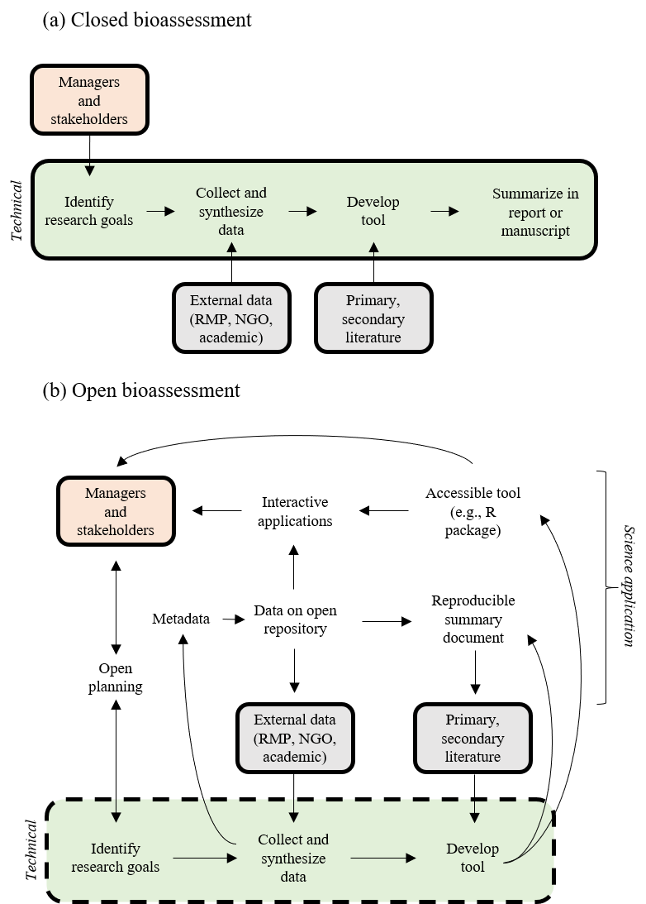

```{r setup, echo = F, warning = F, message = F, results = 'hide'}
# figure path, chunk options
knitr::opts_chunk$set(fig.path = 'figs/', warning = F, message = F, echo = F, cache = T, dev.args = list(family = 'serif'), dpi = 300, warning = F, cache.path = 'manu_draft_cache/',
  fig.process = function(x) {
  x2 = sub('-\\d+([.][a-z]+)$', '\\1', x)
  if (file.rename(x, x2)) x2 else x
  })

# libraries
library(Jabbrev)

# extract bib entries from online
bib_scrp('manu_draft.Rmd', 'refs.bib')

```

```{r echo = F, cache = F}
raw <- system('git log -1', intern = TRUE)
raw <- raw[grep('^Date', raw)]
raw <- paste('Version', raw)
```
`r raw`

# Abstract 

Open science principles that seek to democratize science can effectively bridge the gap between researchers and environmental managers, yet widespread adoption has yet to gain traction for the development and appplication of bioassessment methods.  At the core of this philosophy is the concept that research should be reproducible and transparent, in addition to having long-term provenance through effective modes of data preservation and sharing.  We discuss core open science concepts that have been advocated more generally in the ecological sciences and will emphasize how adoption can benefit bioassessment for both prescriptive condition assessments and proactive applications that inform planning activities.  Examples from the state of California will be used to demonstrate effective adoption of open science principles through data stewardship, reproducible research, and engagement of stakeholders with multimedia applications.  Technical, sociocultural, and institutional challenges for adopting open science will also be discussed, including practical approaches for overcoming these hurdles in bioassessment applications.

# Introduction

Bioassessment is an essential element of aquatic monitoring programs that establishes a foundation of decisions for managing the ecological integrity of environmental resources.  Legal mandates to assess biological condition have set a precedent for developing bioassessment methods in the United States (Clean Water Act, CWA), Canada (Canada Waters Act), and Europe (Water Framework Directive).  Decades of research to meet these mandates have supported the development of methods for multiple assemblages with regional applications in streams, rivers, lakes, and marine environments [@Karr86;@Kerans94;@Fore02;@Beck09;@Borja09].  This body of applied tools represents substantial progress in understanding how biological organisms can be used as accurate and interpretable sentinels of environmental condition.  Monitoring programs in the United States and internationally have collected millions of records of biological data spanning decades and hundreds of assessment methods have been developed from these data. The explicit link to environmental management distinguishes bioassessment from basic ecological research.  Although bioassessment can and has been used to inform basic research, the intended use of these tools is to inform the protection and restoration of ecological integrity.  

Bioassessment products will have limited use if they do not meet the needs of management and regulatory communities [@Bain00; @Stein09; @Kuehne17].  In the United States, the CWA gives power to states, tribes, and territories for method development, which in turn requires federal approval to be implemented in a regulatory framework (e.g., Total Maximum Daily Load reporting, stormwater permitting). An imbalance exists between the developed methods and those that are approved for regulatory use.  A recent review of assessment methods for ecological integrity in the US showed that few were explicitly connected to freshwater policy [@Kuehne17].  Of those methods that are actively used, a more problematic issue is the manner of application within standard regulatory frameworks.  Biological indices are typically used to develop post-hoc diagnoses to trigger remediative or restoration actions, or serve as early warning indicators of environmental change [@Niemi04].  A critical concern is that these tools, although technically sound, are implicitly being used to document the long-term demise of environmental health.  A much broader use for bioassessment to guide planning activities, such as identifying conservation priorities [@Linke11;@Howard18], could extend the reach of bioassessment products beyond regulatory applications.

An effective bioassessment product must jointly address the technical challenges of developing a diagnostic index and the implementation challenges of using an index to address the needs of environmental managers and regulators [@Jackson94;@Dale01]. For decades, research in the bioassessment community has focused on addressing the former. Substantial technical advances have been made in predicting biological responses to environmental change, how these responses can be distinguished from natural environmental variation, and determining the impacts of these changes.  Standardized protocols have also been developed [@McDonald04;@Stoddard08].  Many bioassessment indices are characterized as either multimetric, such as an index of biotic integrity [@Karr86], or multivariate where condition is based on predictive methods that evaluate similarity of taxonomic composition to reference expectations.  The reference-condition approach establishes the foundation for many bioassessment methods whereby a set of reference sites are identified and used to evaluate levels of biological deviation to define potential impacts [@Reynoldson97;@Stoddard06]. Most indices can be broadly categorized in the context of these well-established technical methods.

Implementation challenges have limited the use of bioassessment products in management and regulatory applications relative to the availability of developed methods.  Characterizing how an index could be used in practice to inform decisions and prioritize management actions is often opaque relative to why an index may have been originally developed. Hundreds of assessment methods have been developed for specific regional applcations [@Birk12] and concerns about redundancy, comparability, duplicated effort, and lack of coordinated monitoring have recently been discussed within the research community [@Cao11;@Poikane14;@Kelly16;@Nichols16]. Moreover, existing methods may not be discoverable beyond immediate research applications [@Hering10;@Nichols16] or may be incorrectly applied based on differences between goals for developing an index and the needs of management programs [@Dale01;@Stein09].  The abundance of available methods can be a point of frustration for managers given a lack of guidance for choosing an appropriate method among alternatives, particularly as to how a method may relate to specific management, monitoring, or policy objectives [@Dale01;@Stein09].  

Environmental managers require additional tools that transform bioassessment data and methods into actionable information.  A new mode of operation is needed where method development is open and transparent, developed products are discoverable and reproducible, and most importantly, implementation in the management community is intuitive and purposeful.  Open science principles that can democratize all aspects of the scientific method can meet these needs, yet bioassessment research and its application to better serve the environment has not fully embraced these principles. Others have advocated more broadly for inclusion of open science principles in the ecological sciences [@Hampton15;@Hampton16;@Lowndes17] and a growing wave of momentum has influenced how scientists conceptualize research in other disciplines [e.g., archeaology, @Marwick16; behavioral ecology, @Ihle17; vegetation sciences, @Collins16].  Adopting an open science paradigm in biaossessment is particularly relevant compared to other fields given the explicit need to develop tools that are open and accessible to the management community. Legal and ethical precedents in bioassessment may also necessitate the open sharing of data given that environmental monitoring programs are often publicly funded.

This review will demonstrate tools and approaches for open science, which will empower the research and management community to embrace a new mode of thinking for bioassessment applications. These approaches are expected to benefit the research community by augmenting existing workflows for developing assessment tools, but more importantly, improve the ability of these methods to address environmental issues by bridging the gap between the scientific, management, and regulatory communities. An overview of the general principles of open science is provided, followed by a discussion of specific benefits and how these principles can be applied to bioassessment.  We use examples from the state of California to demonstrate how existing tools can be tailored to address legislative mandates for free and open sharing of data, especially by directly engaging stakeholders that require practical approaches for using bioassessment tools in planning activities.  We conclude with a discussion of technical, sociocultural, and instutional hurdles that have, thus far, prevented widespread adoption of open science and provide recommendations for the bioassessment community to address these challenges.

# Principles of open science

Conventional modes of creating scientific products and more contemporary approaches that align with open science principles share the same goals.  Both are motivated by guiding principles of the scientific method that make the process of discovery transparent and repeatable. Where the conventional and open science approaches diverge is the extent to which technological advances are leveraged as instrumental tools that facilitate the entire research process.  Distinction between the two approaches can be conceptualized as the "research paper as the only and final product" for the conventional approach, whereas the open science approach is inherently linked to advances in communication and analysis that have been facilitated by the Internet and computer sciences.  As a result, the open science approach can enhance all aspects of the scientific process from initial conception of a research idea to the delivery and longevity of a research product (Figure \@ref(fig:basicflow)).  The process is iterative where products are improved by the individual and/or others, facilitated by open science tools that enhance access and reproducibility of data.

The paradigm of the research paper as a final scientific product can inhibit forward progress for several reasons, particularly so in the applied sciences.  The research paper is conventially viewed as a communication tool for scientists to report and share results among peers.  Researchers access periodicals to stay informed of scientific advances and use the information to replicate methods for follow-up analysis.  Although the primary literature continues to provide these fundamental services, this workflow is problematic when scientific products are needed to serve interests outside of the research community.  For example, the paper as an endpoint for environmental managers fails to deliver tools that are easily accessible from the practitioners perspective, both in application and interpretation.  A research paper is less likely to affect environmental change because it does not provide a mechanism to transfer actionable information to those that require scientific guidance for decision-making. Numerous studies have documented implementation failures as a result of siloing among research communities where the flow of information does not extend beyond institutional walls.  The loss of information over time that intimately describes a research product is another well-known flaw associated with the paradigm of research paper as final product [@Michener97].

The open science approach makes the researcher a steward of their data. This allows the data to be treated as a living product with a history, rather than proprietary and serving only the internal needs of an immediate research goal. Data can be generically described as any component of the research process that is used to address a research goal and could include tabular data, a laboratory notebook, a dynamic research report, data visualizations or maps, analysis code or software, or even presentation materials.  Open science principles can be applied to any and all of these data with the end goal of facilitating communication for researchers and those for which the research was developed [@BondLamberty16]. These tools also benefit the individual researcher by providing information for the "future-self" to recreate a past working environment. In all cases, the data are openly accessible and documented for reproducibility and discovery using technologies that facilitate communication and sharing.  

Open data can benefit research by contributing to an increase in novel products created through collaboration.  Collaborative publications have increased in the environmental sciences as researchers leverage open data to create synthesis products as the sum of individual datasets. Quantitative meta-analyses and systematic reviews are increasingly used to extract information from the primary literature [@Lortie14].  In addition, open data products can increase efficiency of the individual researcher and a collective research team by encouraging collaborators to adopt an open science workflow.  Many tools developed within the software and computer science community are now easily accessible to environmental scientists that can be used to create open data.  Version control software (e.g, Git, GitHub), open source programming languagues (e.g, R), and integrated development environments (IDEs, e.g., RStudio) can all be leveraged by applied ecologists to dynamically create and share open data products that build instutional memory.  These tools promote deliberate and shared workflows among researchers that can lead to better science in less time [@Lowndes17].

Open and unfettered access to data can also benefit management and regulatory communities.  Although many monitoring datasets are publicly available, the data quality, level of documentation, and ease of use varies widely.  This can create research and implementation challenges as datasets may be difficult to locate, contexts for data may be misunderstood, and data from different sources require synthesis.  Many open science tools can improve the accessibility of data from monitoring programs by establishing workflows for data synthesis and discovery, often through the adoption of a common metadata structure (e.g., Ecological Metadata Language Standard) and integration of data within federated data networks (e.g., DataONE).  Open data maintained by management or regulatory communities benefits the research community, which in turn benefits the data maintainers that require scientific products to inform decisions.  Open data can also improve public trust in scientific findings by exposing the underlying information used to develop a research product [@Grand12].  Increased trust could facilitate eventual adoption of proposed rules or regulations that are based on research products created from open data.

# Applying open science principles to bioassessment

Here we provide a detailed description of open science tools that the bioassessment community could leverage to adopt a a philosophy of creating reproducible, transparent, and discoverable research products for environmental managers.  To emphasize the value that each of these tools can have for specific steps of the scientific process, we first describe a "conventional" workflow, which is then constrasted with a workflow that adopts open science tools.  In both cases, the technical and implementatation phases of a bioassessment product are acknowledged as distinct steps of analysis that describe the entire process from idea conception to adoption in management or regulatory applications.  We use this paradigm to jointly demonstrate how open science tools can be applied beyond the research phase, but also reinforce the concept that a bioassessment product is only as relevant as its applied context (i.e., an index will not have applied value if its final home is the primary literature).

## Closed science

First we consider a hypothetical workflow for how many bioassessment products are potentially created (Figure \@ref(fig:closedopen)a).  Research goals are often identified through legislative requirements to assess biological integrity of surface waters.  In the United States, the process begins at the state-level where regulatory institutions require robust bioassessment methods as defined by federal mandates.  Historically, a regulatory agency may not have ownership of the data required for index development, as for states that separately manage pollutants (e.g., through stormwater or discharge permits) and natural resources (e.g., fisheries).  The required data may also be decentralized across public and private institutions. The task of identifying, gathering, and synthesizing these data may be contracted by the management agency to a third party, such as a private consultant or an academic institution.  This separation between consumers and creators of bioassessment products can be an initial cause of implementation challenges as research agendas may diverge with communication barriers between institutions.  

A typical workflow for developing an index is not entirely dissimilar from a conventional scientific process.  The primary investigator begins by identifying the research goal, developing methods to achieve that goal, and then identifying the data needs and analyses based on the existing science.  Development of a bioassessment index is not explicitly hypothesis-driven, in that an index is not meant to support or refute an academic question, but rather it is implicitly guided by the defined needs for an ecological condition assessment.  The index must predict biological responses to environmental change relative to natural variation and the relative impacts of these changes should be quantifiable.  As noted above, standard procedures that address these technical challenges have generally been accepted by the research community as robust and index development could be considered more procedural than research-oriented.  This can contribute to a relaxation of scientific principles that reinforce reproducibility and attention to detail if the development process is viewed more as a recipe than a formal research endeavor.  

Inadequate documentation of data sources, what data were used, and how data were synthesized can also contribute to implementation challenges in conventional workflows.  Ideally, a monitoring program would provide data that cover the range of natural variability and relevant stressor gradients that influence environmental conditions within an assessment region.  If so, the origin can easily be identified after the product is developed and others will more easily be able to recreate or refine an assessment method as needed.  However, a pre-existing monitoring program may not have goals that align with the needs of a bioassessment product.  The data may also have limitations that affect performance or even prevent their use entirely for assessment.  For example, a fisheries monitoring program may only sample select locations and may have inadequate coverage of aquatic biodiversity.  In these scenarios, supplementary data must be gathered from other sources, all of which potentially have different goals for originally collecting the data.  The end product is a synthesized dataset that may be appropriate to meet the requirements of a bioassessment product, but its origin and workflow to achieve the necessary format may be unknown except to the individual that compiled the data.  This creates significant challenges for future products or policies that depend on the product and may even erode institutional trust if the provenance of the dataset is unknown. 

Finally, most bioassessment workflows usually lack tools for calculation and interpretation of results.  Although the availability and need for documentation of the raw data is important, insufficient resources to facilitate use by managers and policy-makers, both in calculation and interpretation, represents a critical limitation of bioassessment effectiveness with conventional workflows.  The worst case scenario is a spreadsheet-oriented approach to converting raw data into a synthesized index.  Not only is this a major challenge for the researcher that develops the index, but it prevents others from applying the tool to reproduce the results and apply it with novel data.  There are many reasons for these challenges (e.g., lack of documentation, unknown data requirements, no interpretation guidance), but the fundamental issue is inaccessibility of the product. A management or regulatory agency will have no ability to interpret these data and the final product will not pass independent review if the results cannot be reproduced.  

## Using open science tools to enhance bioassessment

The above example is an extreme hypothetical description where bioassessment products fail to affect any positive change in environmental management due to a complete deficiency in openness and failed implementation as a result.  Many existing bioassessment methods can be described more positively, yet the research community could benefit from adopting a more open approach to creating and delivering assessment tools.  This approach is particularly relevant from the perspective of implementation and science translation, as all modes of communication between research, managers, and regulators could be enhanced with open science.  The following section describes key components of the open science process that can faciliate the development and implementation of bioassessment products.  We focus specifically on open science applications for data provenance, method development, and method delivery.    

The overall process is shown in Figure \@ref(fig:closedopen)b as an expansion of general concepts in Figure \@ref(fig:basicflow), with a specific science translation phase for implementation.  The critical difference of this open approach with the closed scenario in Figure \@ref(fig:closedopen)a is the iterative flow of ideas and products between the management community and stakeholders, the researcher developing the bioassessment product, and the broader community that provides data and guidance documents in the primary and secondary literature.  This iterative flow of information is facilitated by 1) openly sharing planning documents, 2) using established metadata standards to document synthesized data products, 3) hosting data products on open repositories, 4) creating reproducible summary documents that integrate the data and research products, and 5) incorporating the developed product into interactive applications that deliver the results to the managers and stakeholders.  The technical phase of defining research goals, collecting and synthesizing data, and developing the bioassessment product remains the sole responsibility of the researcher.  However, the process is distinguished by the flow of information to and from the research phase that can benefit the specific project and the science of bioassessment as a whole.

### Developing bioassessment goals

In an open science paradigm, the goals identified by the researcher for developing a bioassessment product should occur through close interaction with the management or regulatory institution that requires the product.  Establishing goals should occur through a two-way exchange of information where management communicates the assessment needs of a bioassessment product that reflects both legislative reporting requirements and stakeholder concerns.  The researcher developing the bioassessment product should recognize these needs while also considering the potential balance between the goals and limitations of the data or state of the science to meet these goals.  This two-way exchange of information can be accomplished through direct communication and sharing of planning documents to ensure all decisions are transparent, i.e., open planning.  In person meetings are ideal, but planning documents are dynamic and will require remote sharing and revision as ideas progress.  Online tools such as Google documents, Slack discussion channels, and open lab notebooks can be instrumental for collaboration. More informal approaches, such as blogging and sharing ideas on social media, can expose new concepts to the broader community for guidance.  Overall, the iterative exchange of information for identifying goals will ensure that the needs of the management and stakeholder communities will be consistent with the services provided by the research product.  

### Curating bioassessment data

After the goals are established, the researcher identifies requirements and sources of data that need to be synthesized to meet the research needs.  Under a closed scenario, data flows one way from the source to the researcher and is used only as a means to create the final research product.  In the open scenario, the data itself is a product to achieve the research goals and also becomes available to the research and management community as a fully documented source of information that has value beyond the specific project.  The openness of the synthesized data product is one of the primary means of facilitating the implementation phase of a bioassessment product.  The synthesized data product can be used by the individual researcher to create interactive applications for stakeholders to share and explore the data and is also fully integrated into summary reports using software for generating dynamic documents [e.g, using knitr, @Xie15; and RMarkdown, @Allaire18]. The data product also becomes available on an open data repository that is discoverable by other researchers and can contribute to alternative scientific advances beyond the immediate goals. 

A bioassessment researcher operating under an open science paradigm has the responsibility of curating the data from its initial creation to its final home in an open repository.  This responsibility is particularly relevant given that a synthesized dataset can originate from multiple sources and the created output can be indistinguishable from the original data.  For example, a multimetric index may require taxonomic data collected at multiple sites by different institutions, whereas the output data may include summary scores, individual metrics, and any additional supporting information to assess the quality of the output. This requires use of a standardized metadata language (e.g., the Ecological Metadata Language or EML) to document the who, what, and why of a particular dataset.  Adoption of a metadata standard also ensures that a machine-readable file is produced to allow integration into a data repository.  This will allow a synthesized data product to be discoverable beyond the specific research application and will include the metadata to help others understand the context of the data.  Finally, a dataset can be assigned a unique digital object identifier (DOI, e.g., through Zenodo) that provides a permanent address and is also citable to allow researchers to track usage of a bioassessment data product.  

### Using R for bioassessment translation

The most important process of the open science workflow is the translation of bioassessment products to the management and regulatory community.  This process should be fundamentally linked to open source analysis and development tools that can be used to deliver the products using a reproducible and accessible platform.  In particular, the popularity of the R statistical programming language [@RDCT18] has increased in the last ten years and is the most commonly used analysis platform in the environmental sciences.  This software provides `r nrow(available.packages(contriburl = contrib.url("https://cran.rstudio.com", "both")))` user contributed packages (as of `r format(Sys.time(), "%Y-%m-%d")`) and is also a programming language that can be used to create specific analysis workflows.  The availability of existing packages and the ability to create new packages is a strength of R that is under-utilized by the bioassessment community.  An assessment index packaged in R can automate the tedious process of converting raw taxonomic data to summary scores.  An R package is also modular, meaning it includes all necessary analyses, data, and documentation to allow use by others.  This modularity is critical for reaching management and stakeholder communities by providing a tool that redirects the focus on the output and not the technical details that are less important for decision-making.    

Several existing R packages have value for the bioassessment community (Table \@ref(tab:rpkgtab)).  For managing the day to day tasks of working with multiple datasets, the tidyverse suite of packages provides the necessary tools to import, wrangle, explore, and plot almost any data type [@Wickham17b].  These packages are developed around the concept of "tidy" data that provide a common and natural framework for working with data [@Wickham14c].  These principles have importance for bioassessment where the synthesized datasets used to create a product should be logically structured to facilitate use by others.  Although the time and effort required to produce a tidy dataset can seem excessive relative to native formats (e.g., raw sample data), downstream analyses will be greatly facilitated.  The tidyverse also includes the popular ggplot2 package that is based on a syntactical grammar of graphics for plotting [@Wilkinson05;@Wickham09].  This package provides a set of independent plotting geometries and aesthetics that can be built piecewise and is a departure from other graphics packages that represent a collection of special cases that limit the freedom of the analyst.  In bioassessment, ggplot2 can be used both in an exploratory role during the development phase and also to create publication quality graphics.  More importantly, this package provides the building blocks to create a data visualization to convey important components of a bioassessment product to managers and stakeholders.   

Bioassessment data are inherently spatial and recent package development has greatly improved the ability to analyse and map geospatial data in R.  These tools can readily communicate the spatial context of bioassessment products to managers and stakeholders by mapping index or condition scores to stream flow networks, watersheds, and ecoregions, both for high-level planning and site-specific evaluations.  The simple features package [@Pebesma18] was first released in 2016 and has quickly become the most popular approach for working with spatial information in R.  The simple features package uses principles of data storage that parallel those from the tidyverse by representing spatial objects in a tidy and tabular format.  This facilitates analysis by presenting complex spatial structures in an easily readable format that can be integrated in workflows with existing packages, including other mapping packages [e.g., leaflet, @Cheng18; or mapview, @Appelhans18].  This allows the researcher to use a workflow that is focused in a single environment, rather than using separate software for statistical and geospatial analysis.  This reduces the likelihood of losing information or introducing analysis errors as the workflow is more transparent in a single environment.

Other existing R packages can be used to develop statistical models of bioassessment data that are a necessary component of many analyses.  Random forest models have been used to develop predictive bioassessment indices that compare observed taxa to modelled expectations (i.e., O/E indices).  The randomForest package [@Liaw02] uses an ensemble learning approach that is robust to complex, non-linear relationships and interactions between variables.  These models are particularly useful with large, regional datasets that describe natural and anthropogenic gradients in condition.  Many other modelling packages are available in R that can support index development, such as exploratory analyses to evaluate biological response or identifying significant associations of organisms with stressor gradients.  The nlme package can be used to create non-linear mixed effect models that are more flexible than standard regression approaches [@Pinheiro18].  The nlme package can develop models for nested sampling designs, such as repeat visits to sample sites or otherwise confounding variables that contribute information but are not unique observations.  The mgcv package provides similar functionality as nlme, but uses an additive modelling approach where invididual effects can be evaluated as the sum of smoothed terms [@Wood17].  

Currently, only a few existing R packages have been developed speicifically for bioassessment.  For example, the TITAN2 package can be used to develop quantitative evidence of taxon-specific changes in abundance and occurrence across environmental gradients [@Baker15].  Results from this package can support exploratory analysis for developing bioassessment products, such as identifying indicator species.  The results can be also be used post hoc to evaluate potential response of a biological index with changing environmental conditions, such as proposed management actions to improve aquatic habitat.  Alternatively, the indicspecies package provides similar functionality but is based only on species occurrence or abundance matrices across sites [@DeCaceres09].  This package can be used to identify species that occur at particular sites if continuous environmental data are unavailable, such as those that are representative of reference conditions.  Finally, the vegan package has been a staple among community ecologists for multivariate analyses in R, such as clustering and ordination [@Oksanen18]. This package has value for bioassessment as an exploratory tool with a variety of applications, such as analyses that identify comparable assessment sites that minimize natural variation [@Beck13].

Although the R network includes over 10000 user contributed packages, the most underutilized aspect of this software for bioassessment is the creation of new packages to support implementation.  Several tools have been developed and published in the last five years that simplify the process of creating new packages in R [@Wickham15;@Wickham18].  The increasing popularity in the environmental sciences of online repositories for hosting code and software, such as GitHub, also provides a venue for sharing these packages.  The advantages of creating and sharing R packages that are specific to bioassessment applications are important for several reasons.  First, an R package creates a compartmentalized set of instructions developed during the technical research phase that can be executed by anyone with access to the software.  This allows the developer to include important technical elements required for the execution of a bioassessment product within the package, while allowing the end user to focus on how the output can be used to inform decision-making.  R packages also require explicit documentation of the functions and data requirements.  As such, package users will not only have access to underlying code but also understand the why and what for different package functions.  Detailed vignettes can be included in plain language to describe how to use the package.     

Finally, R can be used to create interactive applications that deliver bioassessment products to stakeholders and managers in entirely novel contexts.  In particular, the shiny package was first released for R in 2012 and provides programming tools built around concepts of reactivity, where data inputs and outputs can be modified in real time [@Chang18].  A shiny application is an interactive user interface that is developed with R code, but is a standalone product that can be used without any programming experience.  These applications are deployed online and can extend the reach of bioassessment tools to those that require the information for decision-making but otherwise do not have the time or resources to learn R.  Shiny applications can also be easily linked to other R packages.  For example, a shiny website could be created for users to upload raw data and bioassessment scores could be estimated and reported using an R package developed externally.  This can extend the accessibility of a bioassessment product while maintaining the technical integrity of the original tool.  Moreover, shiny applications are completely customizable and can be tailored to the specific needs of any user.  This distinction separates shiny from other web-based analysis platforms.    

# Open science in practice

Bioassessment methods have been sufficiently developed in California to allow comprehensive condition assessments of stream integrity across regions. Indices using benthic macroinvertebrates and algae provide consistent indications of biological condition across the diverse geography and climates in the state [@Fetscher13;@Ode16;@Mazor16]. A physical habitat index has also been developed that provides complementary information supporting bioassessment data [@Rehn18]. Combined, these indices represent significant achievements in overcoming technical challenges for developing accurate and interpretable bioassessment methods. However, the application of bioassessment data to inform decisions is limited, typically only taking advantage of a fraction of the available methods. Currently, California has no narrative or numeric criteria in place to support designated aquatic life uses in wadeable streams. Beyond policy implications, bioassessment data has limited used in planning activities related to conservation or watershed management.  A synthesis of condition assessments from multiple methods is needed and data must be presented in a context that is relevant to the needs of decision makers.

Recent legal initiatives in California have established a precedent for openly sharing data collected with public funds. The Open and Transparent Wata Data Act passed by the state legislature in 2016 requires water quality institutions to "create, operate, and maintain a statewide integrated water data platform that, among other things, would integrate existing water and ecological data information from multiple databases and provide data on completed water transfers and exchanges" ([AB 1755, Dodd](https://leginfo.legislature.ca.gov/faces/billNavClient.xhtml?bill_id=201520160AB1755)).  This legislation also calls for state agencies to "develop protocols for data sharing, documentation, quality control, public access, and promotion of open-source platforms and decision support tools related to water data".  These aspirations were further supported by a [resolution](https://www.waterboards.ca.gov/press_room/press_releases/2018/pr_water_data_071018.pdf) on July 10, 2018 that formally committed the State Water Resources Control Board to "provide broader access to data used to make local, regional, and statewide water management and regulatory decisions in California".  

The recent policies are a recognition of the disconnect between the state of the science and the level of integration with policy and decision-making.  Although these initiatives are substantial forward progress, the implementation of existing bioassessment methods to support policy or planning remains uncertain.  For example, thresholds for bioassessment indices that are protective of ecosystem integrity are often required for application in a regulatory context.  Thresholds can be identified based on variability of conditions at reference sites, yet the justification for use in policy requires a link between the threshold and ecosystem function.  Moreover, reference conditions may be an unreasonable management target in developed landscapes where biological communities could be constrained by stressors originating at the watershed scale. These constraints represent significant challenges in setting statewide th
resholds for bioassessment indices where goals may be easily met in some areas of the state (e.g., open areas) but not others (e.g., urban areas).  

The Stream Classification and Priority Explorer [SCAPE, @Beck18c] was developed to help identify management priorities in developed landscapes using bioassessment data. First, a statewide landscape model was developed that predicts a range of likely biological condition scores using the California Stream Condition Index [CSCI, @Mazor16] from a suite of watershed metrics (e.g., land cover, road density). Streams where the range of predicted scores were below a defined threshold (e.g., regulatory requirement) were considered constrained, and streams where the predicted range was above this threshold were considered unconstrained. Results were applied to monitoring data from a heavily urbanized watershed to explore how the statewide model can support local management decisions.  Priorities were identifed based on stream constraints from the model, observed CSCI scores, and differences between the observed and expected ranges of scores. For example, most of the sites in the developed portion of the lower watershed scored within their expected ranges, and were therefore given a low priority for restoration. In contrast, two low-scoring sites in the undeveloped upper watershed were prioritized for causal assessment and possible future restoration, whereas three high-scoring sites were prioritized for protection.
  
The SCAPE tool represents one example of how open science can be effectively integrated with bioassessment data.  All aspects of model development, implementation, and translation followed the open workflow in Figure \@ref(fig:closedopen)b. Engagement of a local stakeholder group to identify research goals guided the technical process of developing SCAPE. Continued involvement of this group throughout the life cycle of the project ensured the final product addressed all research goals.  Open source applications used to create SCAPE included the following: 

* Output from the model was made public on a federated data repository, which included metadata and plain language documentation to track provenance of the original information [@Beck18d].  

* The SCAPE tool was created entirely using open-source software [i.e., R, @RDCT18; shiny, @Chang18]. This allowed use of additional packages described above, in addition to specific packages developed to support bioassessment in California (e.g., CSCI).

* A version control system (Git) and online hosting (GitHub) allowed full transparency of decisions that were made to create the tool.  

* A manuscript describing the model in detail was created using knitr and RMarkdown [@Xie15;@Allaire18].  This increased efficiency of the writing process and also minimized the potential of introducing errors into tables or figures by eliminating the need to copy results between different platforms.  

Most importantly, SCAPE is an interactive decision-suppport tool that allows stakeholders to more effectively use bioassessment data to prioritize management actions on the landscape.  Open science aspects of SCAPE enhanced this functionality by providing a transparent and reproducible product that greatly expanded the utility of existing bioassessment products in California. 

# Limitations and solutions

Although the case for open science in bioassessment is appealing, several challenges have prevented the widespread adoption of these principles in practice.  Many of these challenges are not specific to bioassessment and apply more generally to the environmental sciences. First, the technical skillsets required to effectively use open science tools can be frustrating for some researchers.  Conventional and closed workflows used by many scientists are adopted and entrenched because of ease of use, yet the simplicity of such tools limits their power.  In contrast, many open science analysis platforms, such as R, were developed with customization as a key concept defining the functionality.  This creates a tradeoff between ease of use and flexibility where the former is sacrificed by the latter.  Open science tools can improve analysis, documentation, and implementation through greater flexibility, but they expose researchers to entirely new concepts in which many were never trained.  Many scientists are unable to learn new skills given existing demands on their time, and even less so for skills with exceptional learning curves.  The benefits of these approaches may also not be apparent, such as the value for the individual researcher of sharing their data.  Not only are the required skillsets demanding, but the open science toolbox continues to expand as new methods are developed and old methods become obselete.  This requires a researchers to stay abreast of new technologies as they are developed and weigh the tradeoffs of adopting different workflows for different research tasks.  

Advocates for open science are well aware of the technical challenges faced by individuals that have never been exposed to the core concepts.  Most importantly, education and training remain key components for developing skillsets among researchers where the focus is both on learning new skills for transferability and realizing their value for improving science as a whole [@Hampton17].  A goal of many training curriculums is to instill confidence in new users by developing comfort with new workflows, such as replacing a point-and-click style of analysis with one focused on using a command line through a computer terminal. Other approaches to demonstrate the value of new techniques use a side by side approach of closed vs open workflows to show the increased efficiency and power of the latter.  Adoption becomes much more reasonable once the value of investing in learning a new skill is realized.  Advocates of open science also recognize the limitations of teaching in that not all audiences can be reached and not all materials are retained or even used after training.  A technique of letting the trainee become the trainer can be used whereby those that successfully learn new skills can teach others at their home institutions.  Those that also adopt new workflows through training can also direct their research products to facilitate collaboration with non-adopters rather than the latter synthesizing and analyzing their data in potentially suboptimal ways [@Touchon16]. 

Sociocultural challenges may also inhibit the adoption of open science methods.  A common argument against open science is the protection of data that individual researchers may view as proprietary.  There are reasonable arguments to treat data as personal property, particularly if exceptional effort was spent to secure funding for a project and if the data were hard-earned.  These issues are less of a concern for bioassessment where many datasets are collected by institutions that are publicly funded and data accessibility may be mandated by law.  However, both interim and completed research products derived from public data should be available to the broader bioassessment community in an open science paradigm.  This raises an additional concern that researchers making their workflows transparent could expose themselves to increased criticism by their peers and the public [@Lewandowsky16].  This is particularly concerning for bioassessment researchers where the developed products can have important regulatory implications.  However, an argument made throughout this paper is that regulatory, management, and stakeholder groups that will both use and be affected by bioassessment products should be integral contributors to the development of bioassessment products.  Criticism and feedback should be a natural part of development that will facilitate adoption by ensuring the product meets the needs of all parties.

Institutional barriers can also inhibit open science given the scale of change that must occur for adoption. Bureaucratic hurdles can disincentivize initiatives that promote change, particularly if that change originates from researchers not in administrative roles.  Regulatory institutions may also prefer some level of opacity for how research products that influence policy are made available during development.  The level of transparency advocated by open science could be viewed as openning the floodgates for increased legal scrutiny that can undermine the integrity of the public institution.  Despite these reservations, many public institutions now advocate for increased openness as the benefits of doing so to facilitate and engender public trust have been realized.  Open data initiatives are now fairly common and represent a form of advocacy by public institutions for broader adoption of open science principles.  Although these changes represent progress, many institutions have yet to strictly define open science and how it is applied internally and externally.  As open science continues to build recognition, means of integrating toolsets that promote openness and transparency beyond publicly shared data will have to be adopted by regulatory and management insitutions. 

# Conclusions

The relevance of bioassessment applications can be improved with open science by using reproducible, transparent, and effective tools that bridge the gap between research and management.  Many open science tools can improve communication between researchers and managers to expose all aspects of the research process and facilitate implementation to support policy, regulation, or monitoring efforts.  Communication ensures that the developed product is created through an exchange of ideas to balance the potentially competing needs of different sectors and institutions.  The documentation and archiving of data used to create a bioassessment product also ensures that other researchers can discover and build on past efforts, rather than constantly rebuilding the wheel.  Incremental improvements of existing products can reduce the proliferation of site- and taxon-specific methods with limited regional applications by exploring new ways to integrate biological indicators across space and time.   

Efforts to formally recognize and integrate open science in bioassessment are needed now more than ever.  The transition of bioassessment from taxonomic-based indices to molecular approaches presents novel challenges that will only increase in severity as researchers continue to refine methods for molecular applications [@Baird12].  Although molecular-based indices share similar assessment objectives as conventional indices, the data requirements and taxonomic resolution are substantially more complex.  Bioassessment researchers developing molecular methods are and will continue to be inundated with data from high-throughput DNA sequencers.  Systematic approaches to document, catalog, and share this information will be required to advance and standardize the science.  Molecular approaches are also dependent on existing reference libraries for matching DNA samples for taxonomic identification. The integrity of reference libraries depends greatly on the quality of metadata and documentation for contributed samples.  Open science principles should be leveraged in this emerging arena to ensure that new bioassessment methods continue to have relevance for determining the condition of aquatic resources. 

# Figures 

```{r basicflow, fig.cap = 'A simplified workflow of the open science paradigm (adapted from @Hampton15).  All aspects of the research process, from the conception of an idea to publishing a product, can be enhanced using open science tools.  The workflow is iterative where products are continually improved through collaborations facilitated through discovery and reproducibility of open data.'}
knitr::include_graphics('figs/basicflow.png')
```

```{r closedopen, fig.cap = 'Examples of (a) closed and (b) open approaches for bioassessment applications. The green box in each subfigure represents the technical steps of the individual researcher for developing the product, the manager and stakeholder box are those that require or motivate the creation of bioassessment products, the gray boxes indicate sources of external information (data and guidance documents) as input into the technical process, and the open text indicates open components of the planning, translation, or implementation phase of a bioassessment product. Figures were adapted from @Hampton15. NGO: non-government organization, RMP: regional monitoring program.'}

```

# Tables

```{r rpkgtab}
tab <- data.frame(
  Task = c(
    "General", 
    "Mapping, geospatial", 
    "", 
    "", 
    "Statistical modelling", 
    "", 
    "", 
    "Community analysis", 
    "", 
    "", 
    "Science translation", 
    "", 
    ""
    ), 
  Package = c(
    "tidyverse (Wickham 2017)", 
    "sf (Pebesma 2018)", 
    "leaflet (Cheng et al. 2018)", 
    "mapview (Appelhans et al. 2018)", 
    "randomForest (Liaw and Wiener 2002)", 
    "nlme (Pinheiro et al. 2018)", 
    "mgcv (Wood 2017)", 
    "TITAN2 (Baker et al. 2015)", 
    "indicspecies (De Caceres and Legendre 2009)", 
    "vegan (Oksanen et al. 2018)", 
    "shiny (Chang et al. 2018)", 
    "rmarkdown (Allaire et al. 2018)", 
    "knitr (Xie 2015)"
    ), 
  Description = c(
    "A suite of packages to import, wrangle, explore, and plot data.  Includes the popular ggplot2 and dplyr packages.", 
    "A simple features architecture for working with spatial data, including common geospatial analysis functions", 
    "Integration of R with the popular JavaScript leaflet library for interactive maps", 
  "Creates interactive maps to quickly examine and visually investigate spatial data, built off leaflet and integrated with sf", 
    "Create classification and regression trees for predictive modelling", 
    "Non-linear, mixed effects modelling", "Generalized additive modelling", 
    "Ecological community threshold analysis using indicator species scores", 
    "Indicator species analysis", "Multivariate analysis for community ecology", 
    "Reactive programming tools to create interactive and customizable web applications", 
    "Tools for working with markdown markup languages in .Rmd files", 
    "Automated tools for markdown files that process integrated R code chunks"
  ), 
  stringsAsFactors = F
)

# table stuff
cap.val <- 'R packages that can be used in the development, application, and translation of bioassessment products.'

# table
knitr::kable(tab, booktabs = T, caption = cap.val)
```

# References

